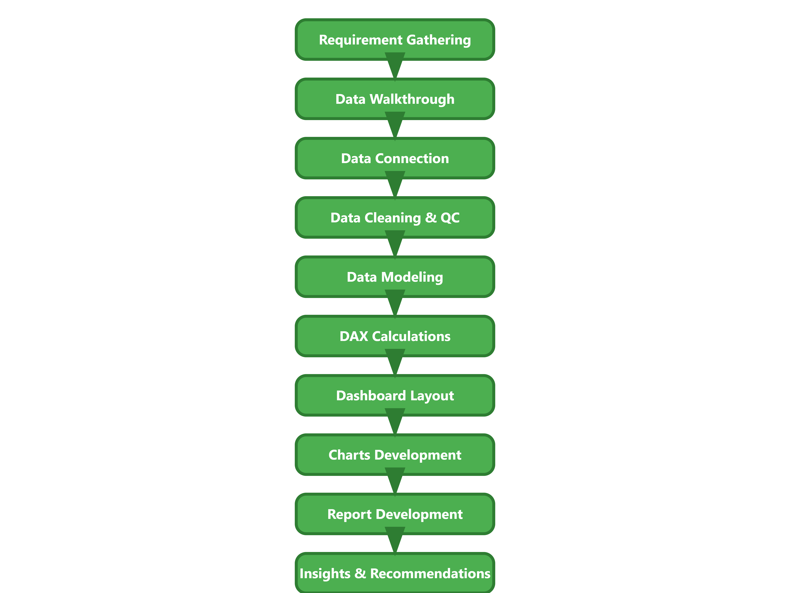
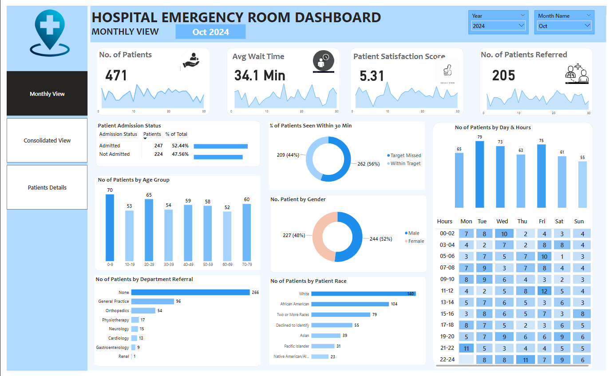

# 🚑 Hospital Emergency Room Dashboard

## 📌 Project Overview
The **Hospital Emergency Room Dashboard** is an advanced **Power BI** solution designed to analyze emergency room (ER) operations, patient demographics, referral patterns, and performance metrics. This interactive dashboard provides **data-driven insights** to enhance decision-making, improve patient care, and optimize resource allocation.

---

## 🏥 Data Fields

### 🔹 **Patient Information:**
- **🆔 Patient ID**: Unique identifier for each patient.
- **📅 Admission Date**: Date & time of ER admission.
- **🔤 First Initial**: First letter of patient’s first name (for anonymization).
- **👤 Last Name**: Anonymized last name.
- **⚧ Gender**: Male, Female, or Other/Nonbinary.
- **🎂 Age**: Patient’s age at admission.
- **🌍 Race**: Self-reported racial/ethnic identity.

### 🔹 **Medical & Operational Data:**
- **🏥 Department Referral**: ER referrals (Cardiology, Orthopaedics, etc.).
- **✅ Admission Flag**: `True` (Admitted) / `False` (Discharged).
- **⭐ Satisfaction Score**: 1-10 rating based on patient experience.
- **⏳ Wait Time**: Time elapsed from arrival to first medical attention.
- **🩺 Case Manager (CM)**: Assigned case manager for patient coordination.

---

## 📊 **Project Workflow**

---

## 📌 **Dashboard Views**
This Power BI report consists of **three interactive dashboards**:
- **📆 Monthly View**: Tracks patient admissions, referrals, and wait times by month.
- **📊 Consolidated View**: Provides an overview of ER efficiency, patient demographics, and department load.
- **🔎 Patient Details**: Focuses on individual patient records and treatment information.

---

## 📈 **Descriptive Analysis (April 2023 - October 2024)**
This dataset covers **9,216 unique patients** over 19 months, revealing crucial insights into ER operations.

### 🔹 **Key Findings:**
- **⏳ Patient Wait Time & Satisfaction:**
  - **Average wait time**: ~35.3 minutes 🚦 (Improvement needed).
  - **Average satisfaction score**: 4.99/10 ⭐ (Moderate satisfaction).

- **🏥 Departmental Referrals:**
  - **5,400 patients** did not require referrals.
  - Common referrals: **General Practice (1,840 cases), Orthopaedics (995 cases), Physiotherapy (276 cases), and Cardiology (248 cases).**

- **📅 Peak Busy Periods:**
  - Busiest days: **Monday (1,377), Saturday (1,322), and Tuesday (1,318).**
  - Busiest hours: **⏰ 11 AM, 1 PM, 7 PM, and 11 PM.**

- **👥 Patient Demographics:**
  - **Age Groups:**
    - Adults (30-39 years): **1,200 patients**.
    - Young adults (20-29 years): **1,188 patients**.
  - **Race Distribution:**
    - **White**: 2,571 patients.
    - **African American**: 1,951 patients.
    - **Multiracial**: 1,557 patients.
    - **Asian**: 1,060 patients.
    - **Declined to identify**: 1,030 patients.

- **🏨 Admission Patterns:**
  - **4,612 patients (50%)** were admitted for further treatment.
  - **4,604 patients** were treated and released.

---

## 📌 **Conclusion & Recommendations**
✅ **Reduce Wait Time**: Optimize **patient flow & staffing** to improve efficiency.  
✅ **Improve Satisfaction**: Address areas with **low patient satisfaction (4.99/10)**.  
✅ **Strategic Staffing**: Peak hours (11 AM, 1 PM, 7 PM, 11 PM) require better workforce allocation.  
✅ **Optimize Departmental Capacity**: General Practice & Orthopaedics referrals indicate a need for increased resources.  
✅ **Diversity & Inclusion**: Data-driven insights support **equitable healthcare services**.  

🚀 This Power BI dashboard provides **actionable insights** for **hospital administrators, ER managers, and healthcare policymakers** to improve emergency room operations and patient care!
